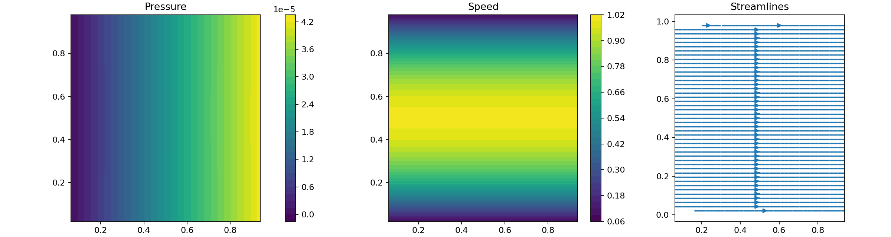

# PySIMPLE

PySIMPLE is a from-scratch, two-dimensional, steady incompressible finite-volume solver for uniform Cartesian staggered grids. It uses SIMPLE pressure–velocity coupling and keeps numerical kernels array-backend generic: select NumPy today or CuPy on a supported CUDA system.

[](https://colab.research.google.com/github/VishalKandala/PySIMPLE/blob/main/notebooks/pysimple_colab.ipynb)

## Supported, verified scope

- Constant-density, constant-viscosity laminar flow
- Uniform Cartesian MAC/staggered grids
- No-slip and prescribed-velocity walls, periodic sides, and a basic pressure outlet
- Lid-driven cavity and periodic body-force-driven plane Poiseuille flow
- Passive steady temperature transport with fixed-temperature or zero-gradient boundaries
- Jacobi or experimental geometric-multigrid pressure correction

The suite verifies staggered-grid layouts, cavity finiteness/residual reduction, a Poiseuille profile against its analytic solution, and pure conduction against the linear analytic temperature profile.

## Baseline verification and CPU measurement

The smallest documented flow verification is an 8×24 periodic, body-force-driven plane-Poiseuille channel. Its analytic solution is parabolic, so it checks the momentum discretization, wall treatment, pressure coupling, and post-processing without relying on an unverified open outlet.

```sh
python -m pysimple poiseuille --nx 8 --ny 24 \
  --output docs/assets/poiseuille-8x24.npz \
  --plot docs/assets/poiseuille-8x24.png \
  --benchmark-repeats 3 \
  --benchmark-output docs/performance/poiseuille-8x24-cpu.json
```

This repository's recorded CPU run converged in 1,097 SIMPLE iterations to a continuity residual of `9.95e-11`. The profile L∞ error was `1.68e-3`; the Fanning friction factor was `0.17898`, versus `24/Re = 0.17949` (0.28% difference). The median of three complete NumPy solves was 2.270 s, or about 2.07 ms per outer iteration. These are small-grid baseline timings, not a CPU/GPU comparison.

Generated artifacts:

- [Poiseuille result archive](docs/assets/poiseuille-8x24.npz)
- [Poiseuille pressure, speed, and streamline plot](docs/assets/poiseuille-8x24.png)
- [Three-run CPU timing record](docs/performance/poiseuille-8x24-cpu.json)



## Run

Install the package for the short `pysimple` command, or use `python -m pysimple` directly from a checkout:

```sh
python -m pip install -e .
```

```sh
python -m unittest discover -s tests -v
pysimple --case cavity --nx 32 --ny 32 --output outputs/cavity.npz
```

The command follows the same named-case style as PyJST. `--case cavity` is the default; `poiseuille` and `channel` are also available. The older positional form (`python -m pysimple poiseuille`) remains supported.

Common controls are visible through `python -m pysimple --help`:

```sh
pysimple --case cavity --reynolds 400 --iterations 5000 --tolerance 1e-7
pysimple --case poiseuille --nx 8 --ny 24 --benchmark-repeats 3
```

For notebooks and scripts, the high-level API has the same case-oriented entry point:

```python
from pysimple import run

completed = run("cavity", nx=32, ny=32, reynolds=100.0)
u, v, pressure = completed.result.u, completed.result.v, completed.result.pressure
```

## Google Colab

The [PySIMPLE Colab notebook](https://colab.research.google.com/github/VishalKandala/PySIMPLE/blob/main/notebooks/pysimple_colab.ipynb) installs the current `main` branch, runs the verified Poiseuille case, prints analytic-comparison metrics, and renders the result. It is CPU-ready by default; use a CUDA runtime and install the matching CuPy wheel before selecting `backend="cupy"`.

Plotting is optional:

```sh
pip install -e '.[viz]'
python -m pysimple cavity --plot cavity.png
```

For CUDA, install the CuPy build appropriate to the system, then choose `--backend cupy`. The NumPy and CuPy paths share the same vectorized finite-volume kernels; GPU parity must be run on the target machine.

## Deliberate current limits

The open inlet/pressure-outlet channel is present as an exploratory case but is **not yet a validated benchmark**. The verified channel benchmark is periodic, body-force-driven Poiseuille flow. Curvilinear/stretched grids, solid obstacles/backward-facing steps, conjugate heat transfer, turbulence models, and transient/artificial-compressibility methods are not implemented.
